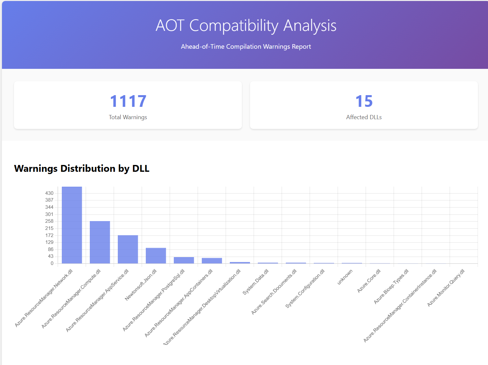

# PR #626 – Remaining Work Items (Deploy & Quota Areas)

Status snapshot (2025-08-12): PR introduces Deploy & Quota command areas. Core feature set, tests, and initial docs are present. The items below track what’s still outstanding before (P0) or soon after (P1) merge; P2 are stretch / nice-to-have.

Legend: P0 = must before merge, P1 = should very soon after, P2 = nice to have.  Use label `PR/626-followup` plus `area/deploy` or `area/quota` and `priority/P{n}` when creating issues.

## P0 (Pre‑merge)
1. [x] Logging & Console output (quota)
   - Files: `areas/quota/src/AzureMcp.Quota/Services/Util/AzureRegionChecker.cs`, `AzureUsageChecker.cs`
   - Replace `Console.WriteLine` with injected `ILogger<T>`; ensure structured messages; remove noisy init logs.
    - Linked Files:
       - [AzureRegionChecker.cs](../areas/quota/src/AzureMcp.Quota/Services/Util/AzureRegionChecker.cs)
       - [AzureUsageChecker.cs](../areas/quota/src/AzureMcp.Quota/Services/Util/AzureUsageChecker.cs)
       - [PostgreSQLUsageChecker.cs](../areas/quota/src/AzureMcp.Quota/Services/Util/Usage/PostgreSQLUsageChecker.cs)
   - Justification (if waived): _<add rationale>_
2. [-] Hard-coded endpoints & scopes
   - `PostgreSQLUsageChecker`: direct `https://management.azure.com/...` URL.
   - `AzureUsageChecker.GetQuotaByUrlAsync` uses hard-coded scope `https://management.azure.com/.default` & raw REST.
   - Action: Prefer ARM SDK where available; otherwise derive base endpoint from `ArmEnvironment` (sovereign-ready) and pass `CancellationToken`.
    - Linked Files:
       - [PostgreSQLUsageChecker.cs](../areas/quota/src/AzureMcp.Quota/Services/Util/Usage/PostgreSQLUsageChecker.cs)
       - [AzureUsageChecker.cs](../areas/quota/src/AzureMcp.Quota/Services/Util/AzureUsageChecker.cs)
   - Justification (if waived): _<add rationale>_
      We confirm that the API has no SDK support and we have to call arm endpoint directly. About the code suggestion, can't find any code about `ArmEnvironment`. And we find the `azure-mcp/areas/monitor/src/AzureMcp.Monitor/Services/MonitorHealthModelService.cs` use the same endpoint to access Azure management plan API.
3. [-] CancellationToken plumbing
   - Commands & services (region/usage checks, app logs, diagram generation) do not accept / propagate a `CancellationToken`.
   - Add CT to public async methods and pass from command execution context.
    - Linked Files (examples):
       - [Usage CheckCommand](../areas/quota/src/AzureMcp.Quota/Commands/Usage/CheckCommand.cs)
       - [Region AvailabilityListCommand](../areas/quota/src/AzureMcp.Quota/Commands/Region/AvailabilityListCommand.cs)
       - [LogsGetCommand.cs](../areas/deploy/src/AzureMcp.Deploy/Commands/App/LogsGetCommand.cs)
       - [DiagramGenerateCommand.cs](../areas/deploy/src/AzureMcp.Deploy/Commands/Architecture/DiagramGenerateCommand.cs)
       - [AzureRegionChecker.cs](../areas/quota/src/AzureMcp.Quota/Services/Util/AzureRegionChecker.cs)
       - [AzureUsageChecker.cs](../areas/quota/src/AzureMcp.Quota/Services/Util/AzureUsageChecker.cs)
   - Justification (if waived): _<add rationale>_
      Code suggestion about `pass from command execution context`, can't find any CancellationToken in 'command execution context'. It will need to update core/framework to add the CT in 'command execution context', and it's out of the scope of current PR.
4. [x] Error handling consistency
   - Avoid `throw new Exception("Error fetching ...: " + error.Message)` which drops stack info; use `throw new InvalidOperationException("...", error)` or rethrow original.
   - Standardize user-facing error text (concise + action guidance).
    - Linked Files (audit for patterns):
       - [AzureUsageChecker.cs](../areas/quota/src/AzureMcp.Quota/Services/Util/AzureUsageChecker.cs)
       - [PostgreSQLUsageChecker.cs](../areas/quota/src/AzureMcp.Quota/Services/Util/Usage/PostgreSQLUsageChecker.cs)
       - [AzureRegionChecker.cs](../areas/quota/src/AzureMcp.Quota/Services/Util/AzureRegionChecker.cs)
       - [LogsGetCommand.cs](../areas/deploy/src/AzureMcp.Deploy/Commands/App/LogsGetCommand.cs)
       - [DiagramGenerateCommand.cs](../areas/deploy/src/AzureMcp.Deploy/Commands/Architecture/DiagramGenerateCommand.cs)
   - Justification (if waived): _<add rationale>_
5. [x] HTTP usage pattern
   - `AzureUsageChecker` keeps a static `HttpClient` (OK) but bypasses dependency injection & resiliency policies.
   - Action: Introduce `IHttpClientFactory` (named client) + Polly (if repo standard) OR justify keeping static client; wrap responses with meaningful exceptions.
    - Linked Files:
       - [AzureUsageChecker.cs](../areas/quota/src/AzureMcp.Quota/Services/Util/AzureUsageChecker.cs)
       - [PostgreSQLUsageChecker.cs](../areas/quota/src/AzureMcp.Quota/Services/Util/Usage/PostgreSQLUsageChecker.cs)
   - Justification (if waived): _<add rationale>_
6. [x] Documentation corrections
   - Verify `docs/azmcp-commands.md` has no duplicated tokens (e.g., earlier “quota quota”) & reflects final hierarchical command names consistently (e.g., ensure `deploy infrastructure rules get` vs lingering `iac rules get` examples).
   - Add brief JSON schema / shape description for `--raw-mcp-tool-input` (architecture diagram + plan) within command docs or link to schema file.
   - Status: Quota section is already correct (shows `azmcp quota usage check` and `azmcp quota region availability list` once each). Remaining fixes are limited to (a) updating any deploy examples still using `deploy iac rules get` to `deploy infrastructure rules get`, and (b) adding the JSON shape/schema description for `--raw-mcp-tool-input`.
    - Linked Files:
       - [azmcp-commands.md](./azmcp-commands.md)
       - [DiagramGenerateCommand.cs](../areas/deploy/src/AzureMcp.Deploy/Commands/Architecture/DiagramGenerateCommand.cs)
       - [Plan GetCommand.cs](../areas/deploy/src/AzureMcp.Deploy/Commands/Plan/GetCommand.cs)
   - Justification (if waived): _<add rationale>_
   The command is `deploy iac rules get` instead of `deploy infrastructure rules get`
7. [x] Source generation coverage review
   - Confirm all JSON-deserialized types used in deploy diagram & plan flows are included in `DeployJsonContext` / `QuotaJsonContext` (nested DTOs, collections). Add any missing types.
    - Linked Files:
       - [DeployJsonContext.cs](../areas/deploy/src/AzureMcp.Deploy/Commands/DeployJsonContext.cs)
       - [QuotaJsonContext.cs](../areas/quota/src/AzureMcp.Quota/Commands/QuotaJsonContext.cs)
       - [DiagramGenerateCommand.cs](../areas/deploy/src/AzureMcp.Deploy/Commands/Architecture/DiagramGenerateCommand.cs)
       - [GetCommand.cs (Plan)](../areas/deploy/src/AzureMcp.Deploy/Commands/Plan/GetCommand.cs)
   - Justification (if waived): _<add rationale>_
8. [x] AOT / trimming validation
   - Run `./eng/scripts/Analyze-AOT-Compact.ps1`; capture results in PR discussion. Address warnings (linker descriptor if needed for YamlDotNet or reflection on embedded resources).
    - Linked Files / Scripts:
       - [Analyze-AOT-Compact.ps1](../eng/scripts/Analyze-AOT-Compact.ps1)
       - [Deploy csproj](../areas/deploy/src/AzureMcp.Deploy/AzureMcp.Deploy.csproj)
       - [Quota csproj](../areas/quota/src/AzureMcp.Quota/AzureMcp.Quota.csproj)
   - Justification (if waived): _<add rationale>_
   Run the script. The result show no AOT issue with "deploy/quota" areas.
   
9. [x] Test gaps (minimum additions)
   - Diagram: invalid JSON, empty service list, over-sized payload (return clear message).
   - Quota: empty / whitespace `resource-types`, mixed casing, unsupported provider => returns “No Limit” entry.
   - Usage checker: network failure path returns descriptive `UsageInfo.Description`.
    - Linked Test Locations (add or extend):
       - [Deploy tests folder](../areas/deploy/tests/)
       - [Quota tests folder](../areas/quota/tests/)
       - [DiagramGenerateCommandTests.cs] (add if missing under deploy tests)
   - Justification (if waived): _<add rationale>_
   Diagram tool updated with no url output so over-sized payload test not needed.
10. [] Security & sovereignty
    - Ensure no region / subscription IDs are written to logs at Information or above without user intent.
    - Confirm no USGov / China cloud breakage due to hard-coded public cloud URLs (see item 2).
      - Linked Files:
         - [AzureUsageChecker.cs](../areas/quota/src/AzureMcp.Quota/Services/Util/AzureUsageChecker.cs)
         - [PostgreSQLUsageChecker.cs](../areas/quota/src/AzureMcp.Quota/Services/Util/Usage/PostgreSQLUsageChecker.cs)
         - [AzureRegionChecker.cs](../areas/quota/src/AzureMcp.Quota/Services/Util/AzureRegionChecker.cs)
    - Justification (if waived): _<add rationale>_
11. [x] CHANGELOG / spelling / build gates
    - Re-run: `./eng/common/spelling/Invoke-Cspell.ps1` and `./eng/scripts/Build-Local.ps1 -UsePaths -VerifyNpx` post edits; update CHANGELOG if additional user-facing behavior changes (e.g., final command names).
      - Linked Files / Scripts:
         - [CHANGELOG.md](../CHANGELOG.md)
         - [Invoke-Cspell.ps1](../eng/common/spelling/Invoke-Cspell.ps1)
         - [Build-Local.ps1](../eng/scripts/Build-Local.ps1)
         - [AzureMcp.sln](../AzureMcp.sln)
    - Justification (if waived): _<add rationale>_
      need to remove the PR md file to pass.
## P1 (Post‑merge, near term)
1. [-] Log retrieval abstraction
   - Introduce `IAzdAppLogService` (or extend existing interface) wrapping current implementation; mark with `// TODO: Replace with native azd logs command when available`.
    - Linked Files:
       - [LogsGetCommand.cs](../areas/deploy/src/AzureMcp.Deploy/Commands/App/LogsGetCommand.cs)
       - [Services folder](../areas/deploy/src/AzureMcp.Deploy/Services/)
   - Justification (if waived): _<add rationale>_
   No azd logs command now. will delete this tool when azd log supported.
2. [x] Extension service reuse
   - Evaluate delegating AZD / AZ related operations via existing extension services (`IAzdService`, `IAzService`) to avoid duplication & ease future azd MCP server integration.
    - Linked Files:
       - [Extension AzdCommand.cs](../areas/extension/src/AzureMcp.Extension/Commands/AzdCommand.cs)
       - [Extension AzCommand.cs](../areas/extension/src/AzureMcp.Extension/Commands/AzCommand.cs)
       - [Deploy Services folder](../areas/deploy/src/AzureMcp.Deploy/Services/)
   - Justification (if waived): _<add rationale>_
      No reuse/conflict with existing IAzdService/IAzService. The Deploy service works as a workflow which guide users to use azd/az command.
3. [-] Improve quota provider extensibility
   - Replace switch/enum mapping with pluggable strategy registration; add test demonstrating adding new provider without core code change.
    - Linked Files:
       - [AzureUsageChecker.cs](../areas/quota/src/AzureMcp.Quota/Services/Util/AzureUsageChecker.cs)
       - [Usage provider classes](../areas/quota/src/AzureMcp.Quota/Services/Util/Usage/)
   - Justification (if waived): _<add rationale>_
   Current switch mode provide enough extensibility and adding new provider will not impact existing provider logic.
   No need to use pluggable strategy registration since this method is not shared code.
4. [-] Unified cancellation & timeout strategy
   - Standardize default timeouts (e.g., 30s) with graceful fallback message; document in command help.
    - Linked Files:
       - [Command files (deploy)](../areas/deploy/src/AzureMcp.Deploy/Commands/)
       - [Command files (quota)](../areas/quota/src/AzureMcp.Quota/Commands/)
   - Justification (if waived): _<add rationale>_
   It require core framework supports.
5. [ ] Structured output contracts doc
   - Document JSON contract (property names, nullability) for: usage check, region availability, app logs, plan, diagram (mermaid wrapper), IaC rules.
    - Linked Files (producers):
       - [CheckCommand.cs](../areas/quota/src/AzureMcp.Quota/Commands/Usage/CheckCommand.cs)
       - [AvailabilityListCommand.cs](../areas/quota/src/AzureMcp.Quota/Commands/Region/AvailabilityListCommand.cs)
       - [LogsGetCommand.cs](../areas/deploy/src/AzureMcp.Deploy/Commands/App/LogsGetCommand.cs)
       - [GetCommand.cs (Plan)](../areas/deploy/src/AzureMcp.Deploy/Commands/Plan/GetCommand.cs)
       - [DiagramGenerateCommand.cs](../areas/deploy/src/AzureMcp.Deploy/Commands/Architecture/DiagramGenerateCommand.cs)
       - [RulesGetCommand.cs](../areas/deploy/src/AzureMcp.Deploy/Commands/Infrastructure/RulesGetCommand.cs)
   - Justification (if waived): _<add rationale>_
6. [ ] Additional tests
   - JSON round-trip (serialize/deserializing sample payloads) proving source-gen (no reflection fallback).
   - Large region list & large quota response handling (ensure no OOM or excessive token usage in responses).
    - Linked Test Locations:
       - [Quota tests](../areas/quota/tests/)
       - [Deploy tests](../areas/deploy/tests/)
   - Justification (if waived): _<add rationale>_
7. [ ] Performance micro-optimizations
   - Reuse `TokenRequestContext` instances; minimize allocations in diagram generation (StringBuilder pooling if hot path).
    - Linked Files:
       - [AzureUsageChecker.cs](../areas/quota/src/AzureMcp.Quota/Services/Util/AzureUsageChecker.cs)
       - [DiagramGenerateCommand.cs](../areas/deploy/src/AzureMcp.Deploy/Commands/Architecture/DiagramGenerateCommand.cs)
   - Justification (if waived): _<add rationale>_
8. [ ] Template system consolidation
   - Ensure all multi-line textual responses (rules, plan guidance, pipeline guidance) load via `TemplateService`; add unit tests asserting presence/placeholder substitution.
    - Linked Files / Folders:
       - [Templates folder (deploy)](../areas/deploy/src/AzureMcp.Deploy/Templates/)
       - [TemplateService (if present)](../areas/deploy/src/AzureMcp.Deploy/Services/)
   - Justification (if waived): _<add rationale>_
9. [ ] Logging verbosity flag
   - Introduce `--verbose` (or reuse global) to elevate detail; keep default output lean.
    - Linked Files:
       - [Global options / CLI setup](../core/src/AzureMcp.Core/)
       - [Deploy command files](../areas/deploy/src/AzureMcp.Deploy/Commands/)
       - [Quota command files](../areas/quota/src/AzureMcp.Quota/Commands/)
   - Justification (if waived): _<add rationale>_
10. [ ] Metrics / telemetry hooks (if allowed)
   - Add (opt-in) counters: command invocation count, duration buckets, failure categories.
    - Linked Files (potential hooks):
       - [Core infrastructure](../core/src/AzureMcp.Core/)
       - [Deploy entry points](../areas/deploy/src/AzureMcp.Deploy/)
       - [Quota entry points](../areas/quota/src/AzureMcp.Quota/)
   - Justification (if waived): _<add rationale>_

## P2 (Deferred / Nice to Have)
1. [ ] Region & quota caching
   - Short-lived in-memory cache keyed by (subscription, provider, location) (TTL e.g., 5–10 min) to reduce repeated calls.
    - Linked Files:
       - [AzureUsageChecker.cs](../areas/quota/src/AzureMcp.Quota/Services/Util/AzureUsageChecker.cs)
       - [AzureRegionChecker.cs](../areas/quota/src/AzureMcp.Quota/Services/Util/AzureRegionChecker.cs)
   - Justification (if waived): _<add rationale>_
2. [ ] Parallelism tuning
   - Constrain parallel fan-out (SemaphoreSlim) for very large resource type lists to avoid throttling.
    - Linked Files:
       - [AzureUsageChecker.cs](../areas/quota/src/AzureMcp.Quota/Services/Util/AzureUsageChecker.cs)
       - [AzureRegionChecker.cs](../areas/quota/src/AzureMcp.Quota/Services/Util/AzureRegionChecker.cs)
   - Justification (if waived): _<add rationale>_
3. [ ] Enhanced diagram generation
   - Support optional layers (network / security) via flags while keeping current default simple; enforce size limits.
    - Linked Files:
       - [DiagramGenerateCommand.cs](../areas/deploy/src/AzureMcp.Deploy/Commands/Architecture/DiagramGenerateCommand.cs)
       - [GenerateMermaidChart helper (if present)](../areas/deploy/src/AzureMcp.Deploy/Commands/Architecture/)
   - Justification (if waived): _<add rationale>_
4. [ ] CLI help enrichment
   - Add “See also” sections linking related commands (e.g., plan → rules → pipeline guidance → logs).
    - Linked Files:
       - [DeploySetup.cs](../areas/deploy/src/AzureMcp.Deploy/DeploySetup.cs)
       - [QuotaSetup.cs](../areas/quota/src/AzureMcp.Quota/QuotaSetup.cs)
   - Justification (if waived): _<add rationale>_
5. [ ] Validation utilities
   - Centralize resource type & region normalization in shared helper (dedupe logic across quota & deploy areas).
    - Linked Files (candidates):
       - [AzureUsageChecker.cs](../areas/quota/src/AzureMcp.Quota/Services/Util/AzureUsageChecker.cs)
       - [AzureRegionChecker.cs](../areas/quota/src/AzureMcp.Quota/Services/Util/AzureRegionChecker.cs)
       - [Shared helpers folder (add new)](../core/src/AzureMcp.Core/)
   - Justification (if waived): _<add rationale>_
6. [ ] Developer area READMEs
   - `areas/deploy/README.md` & `areas/quota/README.md` summarizing purpose, extension points, deprecation intent for temporary commands.
    - Linked Files (to create):
       - [deploy/README.md](../areas/deploy/README.md)
       - [quota/README.md](../areas/quota/README.md)
   - Justification (if waived): _<add rationale>_
7. [ ] Automated smoke tests in CI
   - Lightweight invocations of each new command behind feature flag / mock mode to catch regressions early.
    - Linked Files / Locations:
       - [CI pipeline yaml](../eng/pipelines/ci.yml)
       - [Test harness(es)](../core/tests/)
   - Justification (if waived): _<add rationale>_
8. [ ] Diagram diffing test harness
   - Golden file comparison (with stable ordering) to detect unintended structural changes.
    - Linked Files / Locations:
       - [Deploy tests folder](../areas/deploy/tests/)
       - [Golden files folder (to add)](../areas/deploy/tests/Diagrams/)
   - Justification (if waived): _<add rationale>_

   ## Additional Compliance Items from `docs/new-command.md` Review

   The following gaps were identified when comparing PR #626 implementation to the command authoring guidance in `docs/new-command.md`.

   ### P0 (Pre‑merge)
   12. [-] Command naming pattern audit
         - Ensure every command class follows `{Resource}{SubResource?}{Operation}Command` (e.g., `PlanGetCommand`, `InfrastructureRulesGetCommand`, `PipelineGuidanceGetCommand`, `ArchitectureDiagramGenerateCommand`, `AppLogsGetCommand`, `UsageCheckCommand`, `RegionAvailabilityListCommand`).
         - If current classes use shortened forms (e.g., `GetCommand`, `RulesGetCommand`, `GuidanceGetCommand`, `DiagramGenerateCommand`, `LogsGetCommand`) without the primary resource prefix, evaluate renaming for consistency OR document an explicit exception rationale.
         - Linked Files:
            - [Deploy Commands](../areas/deploy/src/AzureMcp.Deploy/Commands/)
            - [Quota Commands](../areas/quota/src/AzureMcp.Quota/Commands/)
      - Justification (if waived): _<add rationale>_
      Class name follow the suggestion in https://github.com/qianwens/azure-mcp/commit/0215c924be0471fa2d6d08aee74e5f890c75c8ef.
   13. [x] Service interface coverage
         - Each logical capability should have a service interface + implementation rather than embedding logic directly in command classes (plan, rules, pipeline guidance, diagram generation, app logs, quota usage, region availability). Verify a corresponding `I*Service` exists; add missing ones.
         - Linked Files:
            - [Deploy Services](../areas/deploy/src/AzureMcp.Deploy/Services/)
            - [Quota Services](../areas/quota/src/AzureMcp.Quota/Services/)
      - Justification (if waived): _<add rationale>_
   14. [x] OptionDefinitions reuse & duplication check
         - Confirm no redefinition of global/area options in per-command options; ensure only incremental properties added. Validate subscription parameter consistently named `subscription` (never `subscriptionId`).
         - Linked Files:
            - [Deploy Options](../areas/deploy/src/AzureMcp.Deploy/Options/)
            - [Quota Options](../areas/quota/src/AzureMcp.Quota/Options/)
      - Justification (if waived): _<add rationale>_
   15. [x] Area registration ordering
         - Verify new areas (Deploy, Quota) appear in alphabetical order in `Program.cs` area registration array.
         - Linked Files:
            - [Program.cs](../core/src/AzureMcp.Cli/Program.cs)
      - Justification (if waived): _<add rationale>_
      Sort the registration array. But it cause existing files also be sorted.
   16. [x] Unit test completeness per command
         - Ensure every command has a corresponding `*CommandTests` class (naming aligns with command naming pattern) covering validation & success paths.
         - Linked Files:
            - [Deploy Unit Tests](../areas/deploy/tests/)
            - [Quota Unit Tests](../areas/quota/tests/)
      - Justification (if waived): _<add rationale>_
   17. [x] Error handling override usage
         - For commands with domain-specific errors, override `GetErrorMessage` / `GetStatusCode` per guidance rather than relying solely on base behavior; add missing overrides where user-actionable mapping adds value.
         - Linked Files:
            - [Deploy Commands](../areas/deploy/src/AzureMcp.Deploy/Commands/)
            - [Quota Commands](../areas/quota/src/AzureMcp.Quota/Commands/)
      - Justification (if waived): _<add rationale>_

   ### P1 (Post‑merge)
   11. [x] Live test infrastructure
         - Add / validate `test-resources.bicep` & optional `test-resources-post.ps1` for Deploy & Quota areas if live (integration) tests depend on Azure resources (diagram/plan may not; quota usage & region availability likely do). If intentionally omitted, document rationale.
         - Linked Files:
            - [Quota tests root](../areas/quota/tests/)
            - [Deploy tests root](../areas/deploy/tests/)
      - Justification (if waived): _<add rationale>_
   12. [x] Naming consistency in test classes
         - Ensure test class names mirror final command class names exactly (e.g., `PlanGetCommandTests`). Rename where mismatched.
         - Linked Files:
            - [Deploy tests](../areas/deploy/tests/)
            - [Quota tests](../areas/quota/tests/)
      - Justification (if waived): _<add rationale>_
   13. [ ] Formatting/style conformance
         - Method signatures & parameter wrapping per examples in guidance (`one parameter per line`, aligned indentation). Apply if any deviations exist in new files.
         - Linked Files:
            - [Deploy Services](../areas/deploy/src/AzureMcp.Deploy/Services/)
            - [Quota Services](../areas/quota/src/AzureMcp.Quota/Services/)
      - Justification (if waived): _<add rationale>_
   14. [ ] Consistent base command inheritance
         - Confirm every command inherits an appropriate `{Area}Command<TOptions>` base (if any direct inheritance from generic base is used, unify design or document exception).
         - Linked Files:
            - [Deploy Commands](../areas/deploy/src/AzureMcp.Deploy/Commands/)
            - [Quota Commands](../areas/quota/src/AzureMcp.Quota/Commands/)
      - Justification (if waived): _<add rationale>_
   15. [ ] Centralized normalization helpers
         - (If not addressed earlier P2 item) Extract shared parsing / normalization (resource types, region codes) to a shared helper to reduce repetition across commands & services per guideline emphasis on reuse.
         - Linked Files:
            - [Quota Services Util](../areas/quota/src/AzureMcp.Quota/Services/Util/)
            - [Deploy Services](../areas/deploy/src/AzureMcp.Deploy/Services/)
      - Justification (if waived): _<add rationale>_
   16. [ ] Enhanced troubleshooting messages
         - Ensure error messages include actionable remediation hints (auth, network, throttling) in alignment with guidance examples; add or adjust where currently passive.
         - Linked Files:
            - [Deploy Commands](../areas/deploy/src/AzureMcp.Deploy/Commands/)
            - [Quota Commands](../areas/quota/src/AzureMcp.Quota/Commands/)
      - Justification (if waived): _<add rationale>_
   17. [ ] Consistent logging context
         - Include key identifiers at Debug/Trace (not Info) per security guidelines; unify field naming (`subscription`, `region`, `resourceType`).
         - Linked Files:
            - [Quota Services](../areas/quota/src/AzureMcp.Quota/Services/)
            - [Deploy Services](../areas/deploy/src/AzureMcp.Deploy/Services/)
      - Justification (if waived): _<add rationale>_

   ### P2 (Deferred)
   9. [ ] Live test scenario expansion
         - Add multi-region and failure simulation live tests for quota & deploy (e.g., intentionally invalid resource type) once base live infra exists.
         - Linked Files:
            - [Quota Live Tests](../areas/quota/tests/)
            - [Deploy Live Tests](../areas/deploy/tests/)
      - Justification (if waived): _<add rationale>_
   10. [ ] Test resource cost optimization
         - Review any created test resources; ensure minimal SKUs and cleanup practices (align with cost-conscious guidance in new-command doc).
         - Linked Files:
            - [Area test-resources.bicep files](../areas/)
      - Justification (if waived): _<add rationale>_
   11. [ ] Golden output samples for contracts
         - Provide sample JSON outputs (checked into tests) for each command to detect contract drift.
         - Linked Files:
            - [Deploy tests](../areas/deploy/tests/)
            - [Quota tests](../areas/quota/tests/)
      - Justification (if waived): _<add rationale>_

   NOTE: If any items above are already satisfied but not yet documented, append a short "Rationale/Completion" note under the item rather than removing it to preserve auditability.

## Issue Creation Template (copy/paste)
```
Title: [P0|P1|P2] <short action>: <deploy|quota>
Labels: area/<deploy|quota>, priority/P#, PR/626-followup

Problem
<brief>

Acceptance Criteria
- [ ] ...
- [ ] ...

References
<file path>:L<line> (if applicable)
PR #626
docs/PR-626-Remaining-Work.md

Owner: <name>
Due: <date>
```

## Quick Verification Commands (reference)
```
./eng/scripts/Build-Local.ps1 -UsePaths -VerifyNpx
./eng/common/spelling/Invoke-Cspell.ps1
dotnet build AzureMcp.sln
```

## Completion Definition
All P0 items checked off (or explicitly waived with rationale in PR discussion) + build/test/spelling/AOT analyses green. P1 items converted to issues with owners & due dates.

---
Maintainer note: Update this document (appending a “Changelog” section) rather than editing historical entries when marking items done; keep an auditable trail.
